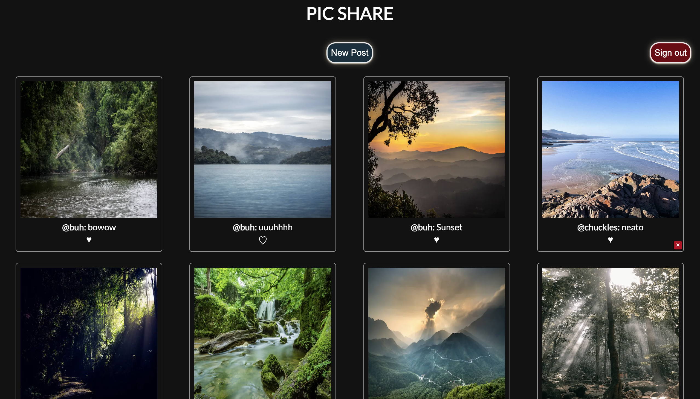

# Pic-Share!

Pic-Share is an app for sharing and browsing user-submitted images. You can create and delete posts, as well as like and comment on posts.



## Features

- Built with NextJS.
- Built with Supabase for a managed Postgres database.
- Also utlizes Supabase for user creation, verification, authentication, and credential security.
- Built with Cloudinary for image hosting and storage.

## Demo

<!-- Currently Unavailable -->

## Installation

Fork or clone the repository.

You will need a Supabase account to store data for the application. You will need a Cloudinary account to host the images.

### Supabase Setup

Once you have set up a Supabase account, create a new project. Inside that project, you will need to create the following tables for your database: comments, posts, and likes. You will also be using an auth.users table, but Supabase should create this for you with your new project.

From your Supabase project page, use the navbar to find the SQL Editor.

Create and run these queries in this order:

```
create table posts (
  id bigint generated by default as identity primary key,
  inserted_at timestamp with time zone default timezone('utc'::text, now()) not null,
  updated_at timestamp with time zone default timezone('utc'::text, now()) not null,
  content text,
  user_id uuid references auth.users (id) on delete cascade,
  url text,
  username varchar(255)
);
```

```
create table likes (
  id bigint generated by default as identity primary key,
  inserted_at timestamp with time zone default timezone('utc'::text, now()) not null,
  updated_at timestamp with time zone default timezone('utc'::text, now()) not null,
    user_id uuid references auth.users (id) on delete cascade,
    post_id bigint references posts (id) on delete cascade
);
```

```
create table comments (
  id bigint generated by default as identity primary key,
  inserted_at timestamp with time zone default timezone('utc'::text, now()) not null,
  updated_at timestamp with time zone default timezone('utc'::text, now()) not null,
  content text,
  username varchar(255),
  post_id bigint references posts (id) on delete cascade,
  user_id uuid references auth.users (id) on delete cascade
);
```

The posts table must be created first, so that the other tables can reference it.

Lastly, we need to link our project to the Supabase account

In the root directory of the project, there is a file named:
`.env.temp`

Change the name of this file, so that it instead is called:
`.env.local`

Open up the file. Inside you will see placeholders for your Supabase URL and API key. The home screen for your project will list your Project URL, and API key. You may have to click the Connect button in the upper right corner and navigate to App Frameworks. Replace the examples inside the file with your own URL and key.

Supabase is now ready to roll.

### Cloudinary Setup

Once you have set up your cloudinary account, you will just need to find the "cloud name" of your project. If you navigate to the Programmable Media tab in the navbar, it should be listed in the dashboard, as well as the upper left corner project dropdown.

Back in the `.env.local` file, change the "EXAMPLE" text in the Cloudinary URL to the "cloud name" of your project.

For instance, if your cloud name was "a1b2c3d4e5", you would change the URL to `CLOUDINARY_URL=https://api.cloudinary.com/v1_1/a1b2c3d4e5/image/upload`

Save the file. Cloudinary is now ready to go.

### Run Project Locally

in the root of the project run:

```
npm install
```

To run the project in development mode, run:

```
npm run dev
```

To run the project in production mode, run:

```
npm run build
```

Once build has finished, run:

```
npm run start
```

Your project is now up and running. To view, navigate to: http://localhost:3000/

## Contributing

Pull requests are welcome. For major changes, please open an issue first to discuss what you would like to change.

## License

[MIT](https://choosealicense.com/licenses/mit/)
